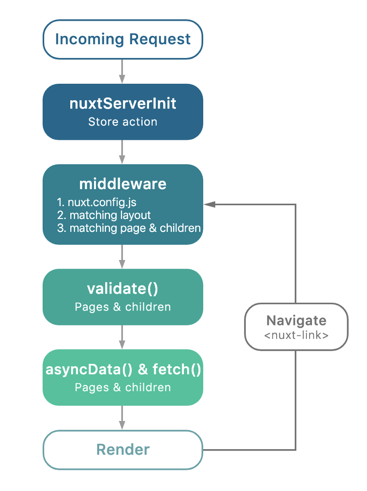

# NextJS

## NextJS 란

---

NextJS는 React 전용 SSR 프레임워크이다.  
NextJS를 사용하지 않고서도 라우팅, SSR을 구현하는 것이 불가능 한것이 아니나, 불편한 것은 사실이다.

공식 홈페이지: https://nextjs.org/

## 왜 사용하는 가

---

사용하게 된 계기는 단지 React 라우팅 관련 자료를 찾아보던 중 발견하게 됐기 때문인데  
사용 목적과는 많이 다른 장점들이 존재했다.

1. Universal Redenring(Isomorphic application)  
   SPA(Single Page Application), CSR(Client-Side Rendering)의 단점인 비교적 느린 초기 렌더링 시간을
   SSR(Server-Side Rendering)을 통하여 대폭 줄였고, 그 이후에 페이지 이동은 페이지 갱신없이 서버로부
   터 필요한 리소스만 받아서 클라이언트에서 렌더링하는 방식으로 초기 렌더링 시간은 줄이고, 서버 자원
   을 아낄 수 있다.

     
   (Next인척하는 Nuxt 사진...)

2. Code Splitting  
   코드 스플리팅이란 SPA에서 번들 파일을 불러올 때 어플리케이션의 규모가 커질수록 로딩 속도가 느린단
   점이 있는데 이런 단점을 해결하고자 번들 파일을 여러개의 파일로 분리시켜 실제로 필요할 때 불러오는
   것이다.

3. Static Exporting  
   어플리케이션을 미리 HTML 파일로 만들어 둠으로써 서버에서도 렌더링 비용을 줄이고 클라이언트도 HTML
   파일만 받아오면 되니 빠른 속도로 렌더링이 가능하게 된다.

4. Ease of use  
   사용해보면 알겠지만 사용 방법이 아주 간단하고 아주 약간의 제약이 있어서 오히려 사용하 기에 편한거
   같다는 생각이든다. pages 디렉토리를 생성하여 그 디렉토리 안에 있는 파일명으로 라우팅하는 정도.

## 튜토리얼

---

개인적으로 NextJS는 튜토리얼 문서화가 잘 되어있는 거 같다.  
전체적으로 한 번 따라해보면 어떤 기능들이 있는지, 사용 방법 등  
튜토리얼 수준에서 알려줄 수 있는 대부분을 배울 수 있는 거같다.

튜토리얼: https://nextjs.org/learn/basics/getting-started

## 참고

- https://blueshw.github.io/2018/04/15/why-nextjs/

- https://velopert.com/3421

- https://holywater-jeong.github.io/blog/react-ssr-next-js/
