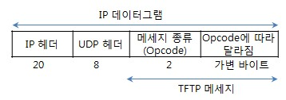

# TFTP (Trivial File Transfer Protocol)

## \# TFTP란,

- UDP 상에서 이루어지는 간단한 파일전송프로토콜(File Transfer Protocol)  
  통상 클라이언트/서버 간에 FTP 같이 복잡한 상호동작이 필요하지 않는 응용에 많이 사용.  
   한편, FTP는 TCP 상에서 비교적 복잡하게 동작 함

## \# 특징

- 이더넷을 사용하여 통신함
- 파일 전송 기능만 제공됨(사용자 인증 수단 없음)
- 프로그램이 간결하고 구축하기 쉬움
- 에러 제어 및 흐름 제어 방식으로는 Stop and Wait 방식 사용
- 동작되는 방식은 클라이언트가 서버에 접속하여 파일을 요청하면 해당 파일을 서버는 전송하고 이를 클라
  이언트는 응답하는 방식을 취한다. 매번 파일의 블록을 전송 시 블록의 길이를 전송하는데 이 블록의 크
  기는 고정되어 있어 이 크기보다 작은 블록이 오면 이를 마지막 블록으로 인식한다.

## \# 사용 예시

- 임베디드 시스템 개발에서, 개발 호스트와 타킷 보드 간에 TFTP로 데이터 전송 
- 원격 서버로부터 부트스트랩 이미지 파일을 TFTP로 가져와서 자동 부팅을 시작

## \# TFTP 메세지 구성

## \# TFTP 메세지의 종류(Opcode)

1. RRQ(Read Request)
2. WRQ(Write Request)
3. DATA
4. ACK(Acknowledgement) // 수신자가 송신자에게 보내는 응답 확인 메세지
5. Error

# 출처

- http://www.ktword.co.kr/abbr_view.php?m_temp1=1835
- http://blog.naver.com/PostView.nhn?blogId=godols2000&logNo=10092515180
